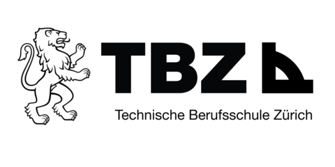

# Willkommen zu meinen Lerndossier für das Modul 231.

In diesem Repository findet ihr meine Dokumentationen zum Modul 231.  
Ein kleine Übersicht zu den Themen:

**LB1**
- [Impressum, Disclaimer und AGB](LB1/Impressum_Disclaimer_AGB_Aufgabe.md)

**LB2**
- [Authentifizierung und Authorisierung](LB2/03_Authentifizierung_Autorisierung.md.md)

**LB3**
- [PGP - Pretty Good Privacy](LB3/02_Verschlüsselte_Nachricht_PGP.md)
- [Checklisten des Datenschutzbeauftragten des Kantons Zürich](LB3/03_Checklisten.md)
- [Auskunft über eigene Personendaten verlangen](LB3/05_Auskunftsrecht.md)
- [Passwortmanager](LB3/06_Passwortmanager.md)

